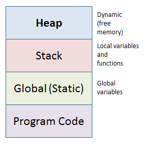

## Динамична памет

### Стекова памет/Stack
- predefined size/предварително определен размер(~2MB)
- паметта се заделя ПО ВРЕМЕ на компилацията на програмата (compile time).
- паметта се освобождава/трие/маркира като свободна автоматично - при излизането от scope-а, в който е дефинирана.

```c++
int value = 5; //allocated on the Stack
```

### Динамична памет/Heap
- паметта се заделя по време на изпълнение на програмата(runtime).
- Масиви и обекти без предварително да е известна големината.

```c++
int value = 5; //allocated on the Stack
int* p = &value; //pointer allocated on the Stack
int* hValue = new int; //hValue is allocated on the stack
                       //allocates 1 integer on the Heap
*hValue = 5; //dereference to give value to the Heap allocated int
```



#### Оператор **new**
- Връща указтел към началото на паметта

```c++
new int[n];  //n НЕ е задължително да е константа!
```

- Заделянето на динамична памет е много "бавна" операция!!
- Динамична памет НЕ се трие автоматично.

#### Оператор delete/delete[]
Oсвобождава/маркира като свободна динамична памет! <br />

```c++
void f()
{
  int x = 40; //allocated on the Stack
  char ch[2] = {'a', 'b'}; //allocated on the Stack
  int* ptr = new int[3]; //allocated on the Heap
}
```


След приключването на функцията ще се изчисти паметта в стека, но НЕ и паметта в heap-а. <br />
За това ние трябва ръчно да я маркираме като свободна. <br />

```c++
void f()
{
  int x = 40;
  char ch[2] = {'a', 'b'};
  int* ptr = new int[3];
  delete[] ptr; //free allocated Heap memory
}
```
## Memory leak (Утечка на памет)
Утечка на памет имаме тогава, когато дадена памет в heap-а бъде заделена, но не бъде зачистена след това. При дълга работа на дадена програма и често възникване на утечки, паметта в heap-a може да свърши! Когато пренасочим указател без да зачистим блока heap памет, към който е сочил, имаме гарантирана утечка!

```c++
int *createArr(int size) {
    return new int[size];
}

int main() {
    int *ptr = new int[5]; //this memory is leaked!

    ptr = createArr(4); //we move the pointer without deleting the memory it was pointing to
    delete[] ptr;
}
```

## Примери:

- Да се напише функция, която приема стринг и връща нов стринг с ТОЧНА ГОЛЕМИНА, в който всички числа са цензурирани. (Всяко число е заменено с '*')
- Да се напише функция, която приема стринг и връща два стринга с ТОЧНА големина. Първият да бъде съставен само от малките букви, а другият да бъде съставен само от главните букви.
- Да се напише функция, която приема масив от целия числа, който е получен след конкатенация на два сортирани масив, и го сортира.
- Да се напише функция, която приема стринг и връща нов стринг, който е съставен от малките латински букви на подадения, но в сортиран вид.

## Задачи

**Задача 1:** Напишете програма, която въвежда от клавиатурата цяло число N и след това създава масив с размер N.

**Задача 2:** Напишете програма, която въвежда от клавиатурата цели числа N и M и след това създава матрица с размер NxM.

**Задача 3:** Напишете програма, която въвежда от клавиатурата цели числа N, M, Q и след това създава триизмерен масив с размер NxMxQ.

**Задача 4:** Напишете програма, която намира сумата на елементите над главния диагонал на квадратна матрица NxN, където N се въвежда от потребителя.

**Задача 5:** Напишете функция, която приема като параметър матрица NxM и връща транспонирата й матрица.

**Задача 6:** Напишете функция, която приема като параметър матрица NxM и матрица PxQ и връща тяхното матрично произведение. <br />
**Note**: NxM . PxQ = NxQ , тоест трябва m == p.

**Задача 7:** Напишете функция, която приема масив от цели числа и цяло число и елемент на масива. Функцията да преподрежда елементите, така че всички по-малки елементи от подадения да са в ляво от него, а всички по-големи - в дясно. (Забележка: Задачата да се реши с помощта на допълнителен масив - същестува и решение без допълнителна памет (Hoare's partition, Lomuto partition и други), но то не се изисква)

*Вход: [1, 5, 6, 3, 0, -1, 2, 9, 7] ,3* *Изход: [1, 0, 2, ,-1, 3, 6, 5, 9, 7]*


**Задача 8:** Напишете функция, която приема масив и връща масив от масиви, на който елементите му са всички непразни подмасиви на дадения.

*Вход: [1, 2, 3]*

*Изход: [1], [2], [3], [1, 2], [2, 3], [1, 3], [1, 2, 3]*


