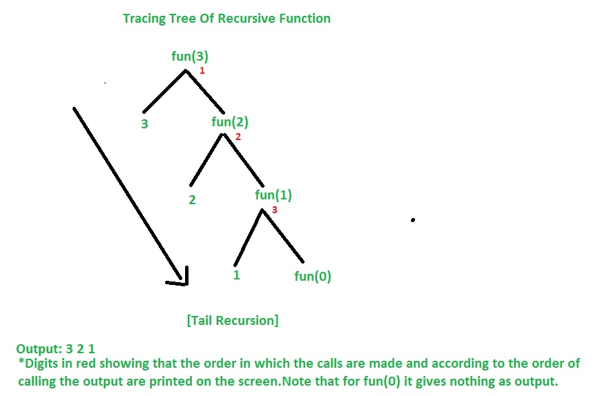
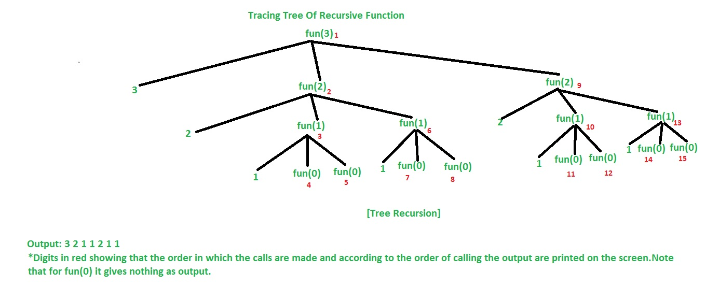
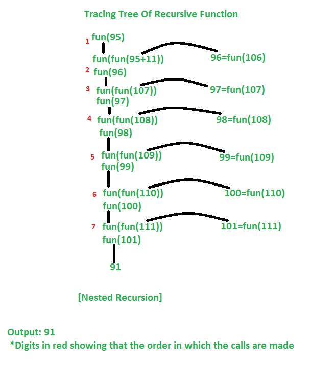

## Бонус теория - видове рекурсии
### **Пряка и косвена рекурсия**
Когато в тялото на метод се извършва извикване на същия метод, казваме, че методът е **пряко рекурсивен**. <br />
```c++
// An example of direct recursion
void directRecFun() {
    // Some code....
    directRecFun();
    // Some code...
}
```

**Видове пряка рекурсия:**
- **Tail** - ако рекурсивното извикване е последната команда/израз.

```c++
#include <iostream>

void fun(int n) {
    if (n > 0) {
        std::cout << n << " ";
        fun(n - 1); // Last statement in the function
    }
}
  
int main() {
    fun(3);
    return 0;
}
```



- **Head** - ако рекурсивното извикване е първата команда/израз.

```c++
#include <iostream>

void fun(int n) {
    if (n > 0) {
        fun(n - 1); // First statement in the function
        std::cout << " "<< n;
    }
}
  
int main() {
    fun(3);
    return 0;
}
```


- **Linear** vs **Tree**
    - **Linear** - ако в тялото на функцията, тя се извиква само веднъж.
    - **Tree** - ако в тялото на функцията, тя се извиква повече от веднъж.

```c++
#include <iostream>
  
// Recursive function
void fun(int n) {
    if (n > 0)  {
        std::cout << " " << n;
          
        // Calling once
        fun(n - 1);
          
        // Calling twice
        fun(n - 1);
    }
}

int main() {
    fun(3);
    return 0;
}
```



- **Nested** - рекурсия в рекурсията. Когато се подаде рекурсия като параметър.

```c++
#include <iostream>
  
int fun(int n) {
    if (n > 100) {
        return n - 10;
    }
  
    // A recursive function passing parameter as a recursive call
    // or recursion inside  the recursion
    return fun(fun(n + 11));
}
  
int main() {
    std::cout << " " << fun(95);
    
    return 0;
}
```




Ако метод A се обръща към метод B, B към C, а С отново към А, казваме, че методът А, както и методите В и C са **непряко (косвено) рекурсивни** или **взаимно-рекурсивни**. <br />
Веригата от извиквания при косвената рекурсия може да съдържа множество методи, както и разклонения, т.е. при наличие на едно условие да се извиква един метод, а при различно условие да се извиква друг. <br />
```c++
// An example of indirect recursion
void indirectRecFun1() {
    // Some code...
    indirectRecFun2();
}

void indirectRecFun2() {
    // Some code...
    indirectRecFun3();
}

void indirectRecFun3() {
    // Some code...
    indirectRecFun1();
}
```


